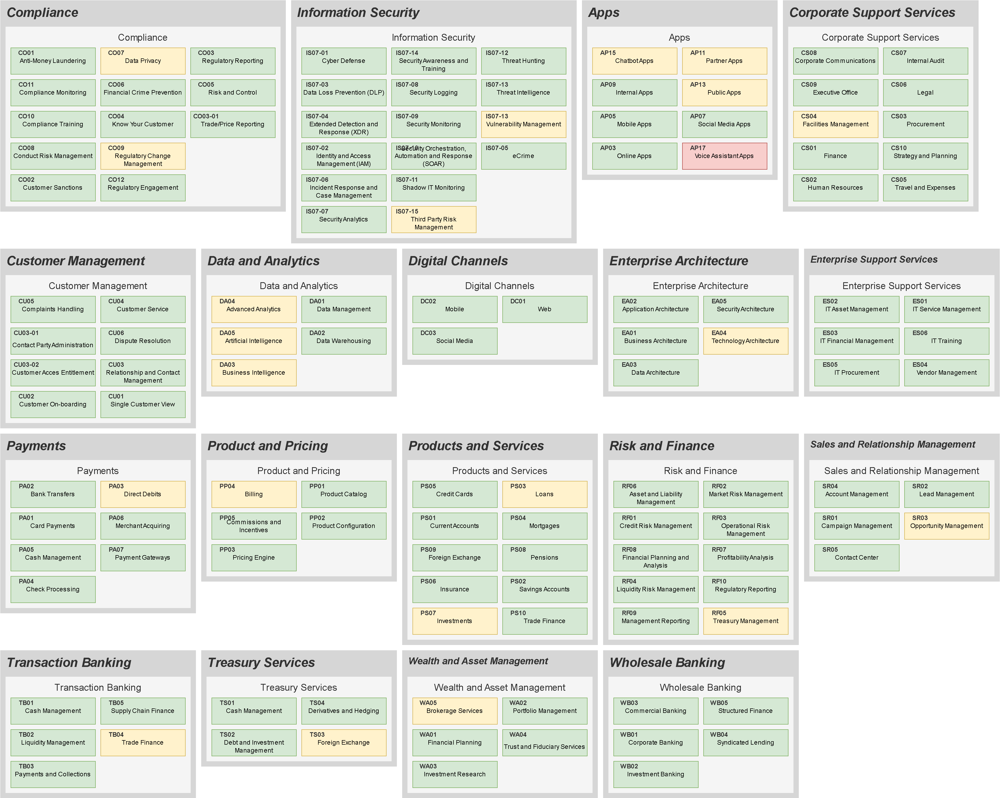

# Capability and Application Landscape in Draw.io 

We take CSV input and make it into a Draw.io diagram for embedding in Confluence or standaone use.

Features:
* Colourisation by Stategy (RAG)
* Colourisation by Category (i.e. Resilience Category)
* Metrics, Hosting and Harvey ball pictograms
* 3-layers
* Self-adjusting to page width
* Configure local setup to open Drww.io automaticall after each render



   


### Usage

Clone the repo then:

1) Update the DRAWIO_EXECUTABLE in the main.py file to point to your drawio executable
2) Run the following command to generate the application landscape map

```bash
python main.py examples\Application_Diagram_Builder.csv
```

### Experiments

1. Try toggling the SHOW_PICTOGRAMS flag in config.py to bring in the Harvey Balls, Arrows and Hosting Platform Icons
2. In Drawio, open layers and toggle visbility to show RAG status in addition to Resilience Category colourization

### Notes
Only L1 is tested at the moment. L0 would create a map one level higher than L1, but the data is not in the example file.
  